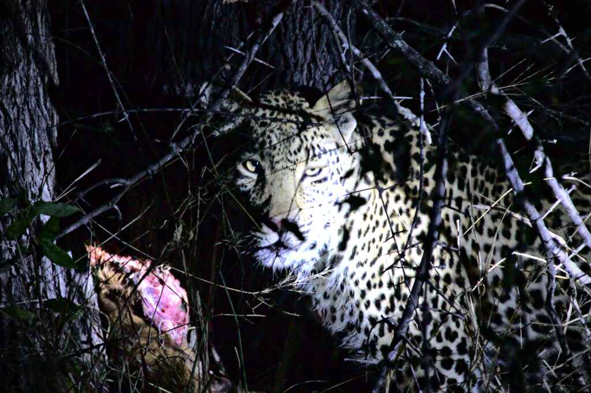

# Default Style

## Idea

Every effect can be achieved in different ways in darktable. As a result, different photographers may achieve similar outcomes with entirely different tools. But on the other hand, any given photographer will develop his own methodology and find himself applying very similar processing to most pictures.

The idea of a *default style* is to save all the commonly used filters as separate style, which can be applied to more or less all (or at least many) pictures. This stile will not be perfect to any of them, but it shall serve as good starting point to otpimize results and hence save time.

## Variants

If you only shoot one style of pictures (e.g. only portrait) you may find *your default editing style*. If you shoot very different images, you may define multiple default styles for different types of images.

However, to keep things simple, in this repository the same default is used for all types of images and processing is optimized for every image from there.

## Examples

The table below shows the effect of the default style used (you can find it under [./Styles/Default.dtstyle](/Styles/Default.dtstyle)) on different types of images. Note that none of them is regarded as perfect and the default style is more meant as starting point for further optimization specific to each image.

| Style         | Rider                                       | Mountain                                       | Portrait                                       | Wildlife                                       |
| ------------- | ------------------------------------------- | ---------------------------------------------- | ---------------------------------------------- | ---------------------------------------------- |
| Original      |     |     |     |             |
| Default Style |  |  |  |  |

## Modules Used

This section will go through the different modules used in this style and shortly explain what they do and why they are there.

### Hot Pixels

The hot-pixels correction would fix errors caused by broken pixels of the sensor. In the example image chosen, there are not broken pixels. However, the hot pixels module shall always be enabled. Most cameras have a hand full of broken pixels.

The default values are used in the style as provided. In most cases they are working pretty well. 

### Demosaic

The demosaic module controls the calculation of all color components for each pixel based on the bayered inputs. To explain this in a bit more detail, it may be important to know how image sensors work. In a nutshell, every pixel only detects one color (red, blue or green). For processing, all color components are required for each pixel. Therefore, the components not detected by the pixel directly, are calcluated based on neighbouring pixels. For example the blue and green components of a pixel that can only detect red are calculated on the neighbour pixels. This process is called *demosaicing*.

Because image processing happens offline, usually you want to focus on quality and not on processing speed. Therefore it is a good idea to chose the better quality *AMaZE* algorithm instead of the faster (and default) *PPG*. 

Usually default settings are okay. In high noise environments, you man want to add a bit of color smoothing. But for images taken at low or medium ISO settings, this certainly is not required and does not have a visible impact.

### Denoise

Noise reduction is especially important for images taken at low light with high ISO settings. Regarding noise, it is crucial to understand that the human eye perceives color information (chroma) completely different than brightness information (luma). Color information is perceived at relatively low resolution while brightness contrasts are what our brain interprets as sharpness. As a result of this completely different perception, it is a good idea to denoise both things separately.

Note that denoising is always a trade-off between removing irritating noise and preserving detail. 

#### Chroma Noise

To understand the effect of chroma noise, a zoomed part of the low-light leopard image taken at ISO 8000 is used. In the original image color noise is clearly visible. There are pixels colored in blue and cyan on a leopard which certainly does not contain blue and cyan colored fur...

| Original                                        | Chroma Denoised                                    |
| ----------------------------------------------- | -------------------------------------------------- |
|  |  |

After denoising according to the default style settings, these irritatingly colored pixels are gone. There is still luma noise (brightess noise) visible but at least color now looks fine.

The default settings of the chroma denoising module are shortly explained below:

* The *wavelet* based denoising works best for chroma noise according to my experience. It allows to treat different feature sizes differently.
* The curve shows how different feature sizes are denoised. Large areas (right side) are not denoised while small features are denoised. This makes sense because noise affects each pixel differently, so it generally produces very small (1 pixel sized) features.
* By default the *denoise (profiled)* module affects luma and chroma. By seting the *blend mode* to *color*, the module is told to only denoise chroma information but not luma.

#### Luma-Noise

To understand the effect of chroma noise, a zoomed part of the low-light leopard image taken at ISO 8000 is used. In the original image color noise is clearly visible. After denoising the image gets much smoother but also looses a little detail.

| Original                                         | Chroma Denoised                                   |
| ------------------------------------------------ | ------------------------------------------------- |
|  |  |

Note that the default settings may not be optimal to this picture as it looks like there is a bit too much detail lost. However, the default style is not meant to be perfect for exactly this picture but to contain reasonable presets.

The default settings of the luma denoising module are shortly explained below:

* The *non-local means* based denoising works best for luma noise according to my experience. 
* Exact setting such as *search radius*, *strength* and *central pixel weight* must be modified a bit for each image, depending on its content.
* By default the *denoise (profiled)* module affects luma and chroma. By seting the *blend mode* to *lightness*, the module is told to only denoise luma information but not chroma.

