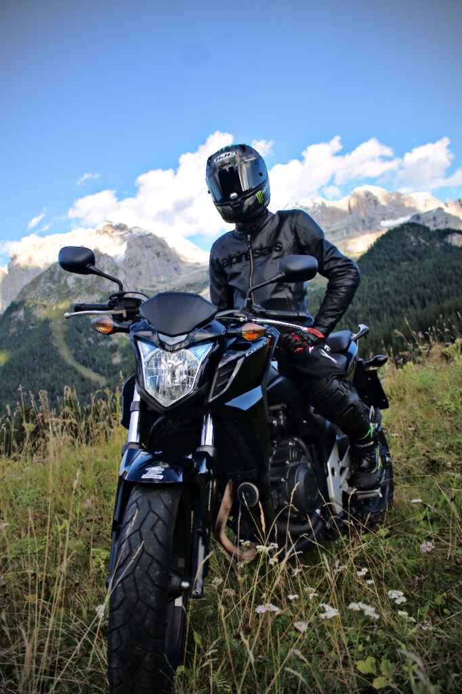
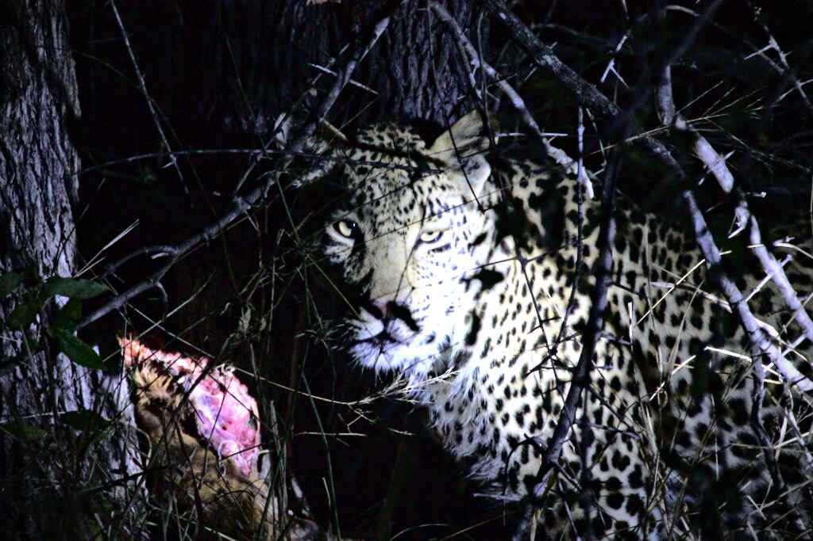

# Darktable-Examples

## The Idea

Darktable is a great photo editing tool but there is only very little literature for it. 

Of course there is the [user manual](https://www.darktable.org/usermanual/en/) which I recommend to have a look at. But this is more the technical documentation about how to operate the tool technically and not about effects you can achieve with it from an artistic standpoint.

There are also plenty of videos on youtube, which certainly are a good source of inspiration. But besides the varying quality, the downside is that often you don't get the real sample data. 

According to my experience, getting real examples with all the editing information is way more helpful than just watching a little video. It allows you enabling and disabling certain modules to directly investigate their effects, modify settings to try out things and to copy history stacks to other images.

This is why I thought launching a GitHub repository including example images and processing styles would be a nice idea.

## How to Contribute

I am not a pro. I do this for my hobby. Chances are good that you know something better, you can improve the results or add some completely new but cool editing style for any of the pictures in this repo. Feel free to fork and add a pull request or write issues. I don't think I know everything and I would like to learn from your feedback.

## Sample Pictures

I decided to pick a hand full of sample pictures from different genres. Most of them come from [signatureedits.com](https://www.signatureedits.com), because I do not cover all genres well. A few of them (especially the wildlife ones) are from myself. Note that the goal here is not to present to coolest pictures, but to pick very typical ones and a few ones with certain errors like high noise level or blur.

If you feel like the samples do not cover some important aspect, let me know and provide a good sample image along.

## Structure of the Repository

This section shortly

* Styles 
  * Darktable styles go here. 
* XX_\<SomePicture\>
  * Each example picture along with its different sidecar files goes into a separate folder
  * Description of different editing style is stored in this folder too
  * There are two subfolders containing the results:
    * web - Low-resolution / high compression outputs for small file size and fast browsing
    * edit - Full-resolution output for full quality

## Where to Continue Reading

### Before you jumpt to the Images

I strongly suggest to read the following sections before you jump to the actual image descriptions. These sections contain the baseline of what the descriptions of the images are based on.

1. [Default Style](./Styles/doc/DefaultStyle.md) - I suggest you start here because many of the edits are built based on this style.

### Sample Images

The different example images are given in the table below for easy navigation. Click on the name of the one you would like to read about.

| Number | Name                                    | Picture                                            | Special Properties                       |
| ------ | --------------------------------------- | -------------------------------------------------- | ---------------------------------------- |
|        |                                         |                                                    |                                          |
| 02     | [Rider](./02_Rider/doc/Overview.md)     |    | None                                     |
| 09     | [Leopard](./09_Leopard/doc/Overview.md) |  | High Noise  High ISO Low Light |
|        |                                         |                                                    |                                          |

