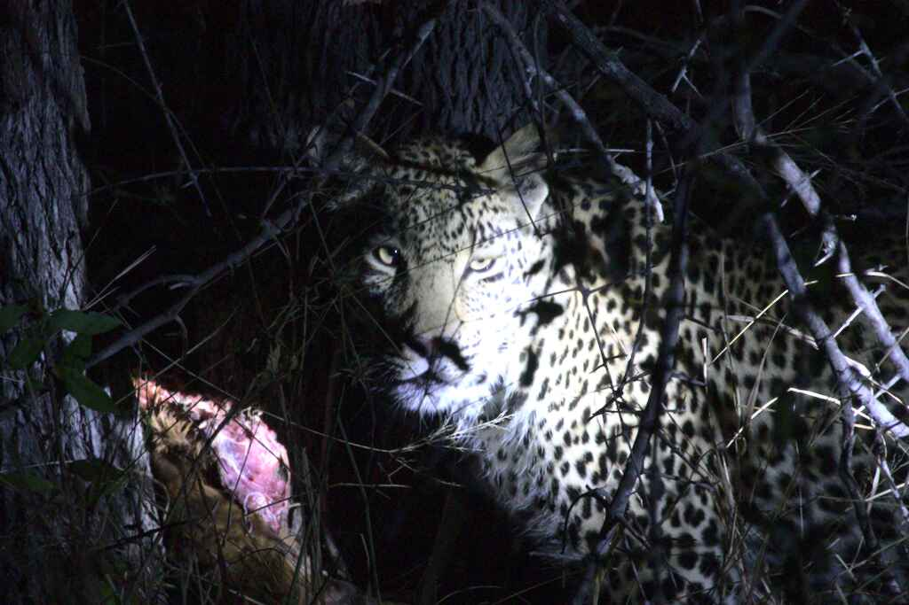
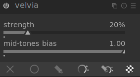

# Default Style

## Idea

Every effect can be achieved in different ways in darktable. As a result, different photographers may achieve similar outcomes with entirely different tools. But on the other hand, any given photographer will develop his own methodology and find himself applying very similar processing to most pictures.

The idea of a *default style* is to save all the commonly used filters as separate style, which can be applied to more or less all (or at least many) pictures. This stile will not be perfect to any of them, but it shall serve as good starting point to otpimize results and hence save time.

## Variants

If you only shoot one style of pictures (e.g. only portrait) you may find *your default editing style*. If you shoot very different images, you may define multiple default styles for different types of images.

However, to keep things simple, in this repository the same default is used for all types of images and processing is optimized for every image from there.

## Examples

The table below shows the effect of the default style used (you can find it under [Styles/Default.dtstyle](../Default.dtstyle)) on different types of images. Note that none of them is regarded as perfect and the default style is more meant as starting point for further optimization specific to each image.

| Style         | Rider                                          | Mountain                                             | Portrait                                             | Wildlife                                           |
| ------------- | ---------------------------------------------- | ---------------------------------------------------- | ---------------------------------------------------- | -------------------------------------------------- |
| Original      |    |    |    |    |
| Default Style |  |  |  |  |

## Modules Used

This section will go through the different modules used in this style and shortly explain what they do and why they are there.

### Hot Pixels

The hot-pixels correction would fix errors caused by broken pixels of the sensor. In the example image chosen, there are not broken pixels. However, the hot pixels module shall always be enabled. Most cameras have a hand full of broken pixels.

The default values are used in the style as provided. In most cases they are working pretty well. 

### Demosaic

The demosaic module controls the calculation of all color components for each pixel based on the bayered inputs. To explain this in a bit more detail, it may be important to know how image sensors work. In a nutshell, every pixel only detects one color (red, blue or green). For processing, all color components are required for each pixel. Therefore, the components not detected by the pixel directly, are calcluated based on neighbouring pixels. For example the blue and green components of a pixel that can only detect red are calculated on the neighbour pixels. This process is called *demosaicing*.

Because image processing happens offline, usually you want to focus on quality and not on processing speed. Therefore it is a good idea to chose the better quality *AMaZE* algorithm instead of the faster (and default) *PPG*. 

Usually default settings are okay. In high noise environments, you man want to add a bit of color smoothing. But for images taken at low or medium ISO settings, this certainly is not required and does not have a visible impact.

### Denoise

Noise reduction is especially important for images taken at low light with high ISO settings. Regarding noise, it is crucial to understand that the human eye perceives color information (chroma) completely different than brightness information (luma). Color information is perceived at relatively low resolution while brightness contrasts are what our brain interprets as sharpness. As a result of this completely different perception, it is a good idea to denoise both things separately.

Note that denoising is always a trade-off between removing irritating noise and preserving detail. 

The denoising settings are explained based on a different image than the other settings because it is easiest to explain denoising based on a very noisy high-ISO image.

#### Chroma Noise

To understand the effect of chroma noise, a zoomed part of the low-light leopard image taken at ISO 8000 is used. In the original image color noise is clearly visible. There are pixels colored in blue and cyan on a leopard which certainly does not contain blue and cyan colored fur...

| Original                                        | Chroma Denoised                                    |
| ----------------------------------------------- | -------------------------------------------------- |
|  |  |

After denoising according to the default style settings, these irritatingly colored pixels are gone. There is still luma noise (brightess noise) visible but at least color now looks fine.

The default settings of the chroma denoising module are shortly explained below:

* The *wavelet* based denoising works best for chroma noise according to my experience. It allows to treat different feature sizes differently.
* The curve shows how different feature sizes are denoised. Large areas (right side) are not denoised while small features are denoised. This makes sense because noise affects each pixel differently, so it generally produces very small (1 pixel sized) features.
* By default the *denoise (profiled)* module affects luma and chroma. By seting the *blend mode* to *color*, the module is told to only denoise chroma information but not luma.

#### Luma-Noise

To understand the effect of chroma noise, a zoomed part of the low-light leopard image taken at ISO 8000 is used. In the original image color noise is clearly visible. After denoising the image gets much smoother but also looses a little detail.

| Original                                         | Chroma Denoised                                   |
| ------------------------------------------------ | ------------------------------------------------- |
|  |  |

Note that the default settings may not be optimal to this picture as it looks like there is a bit too much detail lost. However, the default style is not meant to be perfect for exactly this picture but to contain reasonable presets.

The default settings of the luma denoising module are shortly explained below:

* The *non-local means* based denoising works best for luma noise according to my experience. 
* Exact setting such as *search radius*, *strength* and *central pixel weight* must be modified a bit for each image, depending on its content.
* By default the *denoise (profiled)* module affects luma and chroma. By seting the *blend mode* to *lightness*, the module is told to only denoise luma information but not chroma.

### Lens Correction

Every lens introduces a bit of distortion. The wide angle lenses, cheap lenses and lenses with wide zoom ranges generally introduce more distortion and vignetting. Darktable knows the distortion of all commonly used lenses and can correct them. 

| Without Lens Correction                      | With Lens Correction                             |
| -------------------------------------------- | ------------------------------------------------ |
|  |  |

The corrections are quite subtle and not easy to see side-by-side. If you open the images in a viewer and switch between them, you will notice the distortion easily.

Default settings don't have to be changed but the module must be enabled.

### Tone Curve

The tone-curve module allows to apply a transfer function to all channels of a color-space. This can either be RGB (red, green, blue) or LAB (luminance, blue/yellow, green/red). I tend to use LAB by default and just apply a slight S-curve to the brightness. Depending on the image other corrections may be added later butt I usually start by only using the tone-curve for adjusting brightness with the well-known S-curve.

| Without Tone Curve                               | With Tone Curve                                   |
| ------------------------------------------------ | ------------------------------------------------- |
|  |  |

The default S-curve adds a bit of brightness in the mid-tones and generally enhances contrast a bit.

The tone-curve is one of the major corrections to apply and strongly depends on the content of the image, the lighting conditions and exposure. I therefore usually modify the tone-curve for every image. The default value is only to be seen as a resonable starting-point.

As mentioned before, by default only the brightness (L-channel of LAB color space) is modified. For underexposed pictures where slight difference to the very left of the range make a bit difference, it can be useful to switch to a logarithmic scaling of the X-axis as this increases resolution for the left (dark) area of the tone-curve.

### Contrast Equalizer

The contrast equalizer is one of the most important tools to make an image visually stunning. What it does mathematically (apply more or less contrast to features depending on their size) is not very intuitive. But generally good equalizer settings result in an image being perceived as sharper and more contrast-rich. The equalizer can also be used for various other purposes such as denoising or achieving a bloom effect. However, the settings used in the default  style are more targeted to the contrast enhancement mentioned before.

| Without Equalzer                                 | With Equalizer                                    |
| ------------------------------------------------ | ------------------------------------------------- |
|  |  |

The equalizer settings that perform best for a given image strongly depend on the image content and the features that shall be stressed. As a result, equalizer settings must be changed for each image. 

The equalizer is one of the tools you just need to get a bit of a felling for by playing around with it. Also does it often make sense to overdo the effect just to get a feeling for what feature sizes affect the image in which ways and then step back to sharpening these feature sizes by a reasonable level.

Usually a camel-back applied to luma and chroma is a good starting point for achieving a sharpening effect. So this is what is contained in the default style.

### Shadows and Highlights

Because the dynamic range of a cameras image sensor is way lower than the one of the human eye, images often contain way too dark or too bright areas. The shadows and highlights tool allows to reduce this effect a bit by lighting up shadows and darkening highlights. This is beneficial to almost all images.

Note that it affects the image different than the tone-curve. The tone-curve works on pixel level (each pixel is transformed according to its value). The shadows and highlights tool works on areas of the frame (a pixel may be affected differently depending on the general bringhtness of the area it is in). 

| Without Shadows & Highlights                     | With Shadow & Highlights                                |
| ------------------------------------------------ | ------------------------------------------------------- |
|  |  |

Because shadows and highlights does work on larger areas of the picture, it is less likely to produce dull images as artifact of lighting up darker areas than using the tone-curve. The point here is that a whole dark area is lighted up equally and hence local contrast is preserved.

Depending on the image sliders must be modified a bit but for many images are relatively conservative value of changing highlights and shadows by +/-30 is a good starting point. 

### Haze Removal

Haze removal basically is meant to remove haze. However, I found out that it helpful to many types of images because it adds a bit of clarity. Unfortunately it also seems to have the side-effect of slightly darkening the image, which usually should be compensated through other modules like tone-curve and/or exposure.

| Without Haze Removal                                   | With Haze Removal                                   |
| ------------------------------------------------------ | --------------------------------------------------- |
|  |  |

### Vibrance and Velvia

Something that I have seen often on instagram and I really dislike is pictures with completely overtuned saturation. This of course catches your attention at a first glance but after fractions of a second you realize that pictures don't look natural at all.

Of course enhancing colors a bit can add to pictures looking more vivid, which is good. But darktable has better ways to do so than just tuning up the contrast. I often use vibrance and velvia. Both effects basically add saturation but they do this in a subtle way and not globally.

| Without Vibrance and Velvia                        | With Vibrance and Velvia                             |
| -------------------------------------------------- | ---------------------------------------------------- |
|  |  |

### Vignette

Last but not least, I add a touch of a vignette to all of my images to guide the viewer into the image. Vignettes should not be over-done and be subtle. That's why the default styles vignette is not too obvious.

| Without Vignette                                    | With Vignette                                    |
| --------------------------------------------------- | ------------------------------------------------ |
|  |  |

### Exposure

Note that the default style does not contain the exposure module. This module shall be used to correct under- or overexposed image. Because under- or over-exposure is a defect unique to each image and not present in well exposed images (which I hope should be the majority...) I tend to only add the exposure module if really required.

### Chromatic Aberration

This is another module I don't include in the default style by purpose. While to some images it really is crucial and fixes chromatic errors at the edges of objects, to other images it does more harm than good. It does not seem to work well consistently, so I better like to not have it enabled by default.